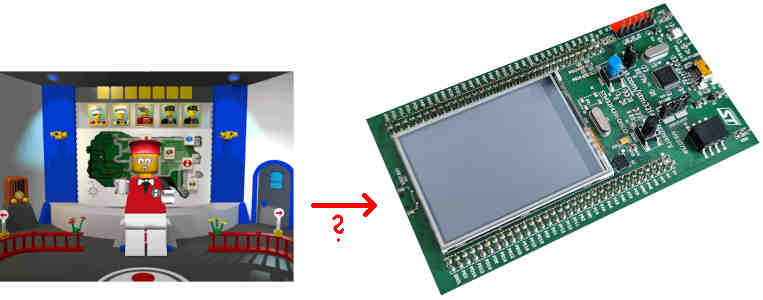

# LEGO Island – Porting to STM32F429 Discovery Kit

Welcome!
This project is an experiment to run *LEGO Island* on the STM32F429 Discovery Kit.

Due to the limited 8 MiB of SDRAM, I'm not yet sure how feasible this is—but I’m eager to find out.
With many years of experience working on embedded systems (with and without operating systems), I'm excited to see how far I can push this.

---

### Project Status

The project is currently buildable and running.

```sh
mkdir -p build
cd build
cmake .. \
  -DCMAKE_TOOLCHAIN_FILE=../baremetal/toolchain-arm-none-eabi.cmake \
  -DBAREMETAL=ON \
  -DISLE_BUILD_APP=ON \
  -DISLE_DEBUG=OFF \
  -DISLE_MINIWIN=ON \
  -DISLE_BUILD_CONFIG=OFF \
  -DBUILD_SHARED_LIBS=OFF \
  -DCMAKE_EXPORT_COMPILE_COMMANDS=ON \
  -DCMAKE_BUILD_TYPE=Debug
make -j12
arm-none-eabi-objcopy -O binary isle isle.bin
```

* **Current SDRAM usage:** \~2.83 MiB out of 8 MiB
* **Available SDRAM left:** \~5.17 MiB

It will be interesting to see how much of the remaining memory can accommodate **models**, **textures**, and **sounds** — fitting everything within the 8 MiB limit is the next challenge!

```
arm-none-eabi-size isle
   text	   data	    bss	    dec	    hex	filename
2767536	 154572	  45752	2967860	 2d4934	isle
```

---

### Emulated Storage (RAMFS)

A minimal **RAM-based file system (ramfs)** has been added to emulate storage.

This allows basic file access within the constraints of the STM32's RAM and is a step toward supporting the game’s asset loading routines.

---

### Debugging in STM32CubeIDE

1. Open the project in **STM32CubeIDE**:
   `baremetal/stm32f429-discovery/`

2. Compile and flash the firmware.

3. In the **GDB Console**, run the following commands:

```gdb
b execute_sdram_code_from_ivt
c
restore /YOUR_ABSOLUTE_PATH/isle-portable-stm32f429/build/isle.bin binary 0x90000000
add-symbol-file /YOUR_ABSOLUTE_PATH/isle-portable-stm32f429/build/isle
b SDL_AppInit
c
```

You should now be able to step through the application and debug as usual.

Currently it fails somewhere badly, forced VIDEO and AUDIO driver "dummy".

---



---

## ✅ Progress Checklist

* \[✅] Make the project compile with `arm-none-eabi-*` toolchain (stub out missing functions)
* \[🚧] Set up a minimal system with FreeRTOS
* \[🚧] Add POSIX thread support (via FreeRTOS)
* \[❌] Implement required parts of the SDL library for STM32F429 — primarily graphics and timers
* \[❌] USB Stack for keyboard and mouse??
* \[✅] Add ramfs to emulate basic storage functionality

[Development Vlog](https://www.youtube.com/playlist?list=PLbpl-gZkNl2Db4xcAsT_xOfOwRk-2DPHL) | [Contributing](/CONTRIBUTING.md) | [Matrix](https://matrix.to/#/#isledecomp:matrix.org) | [Forums](https://forum.mattkc.com/viewforum.php?f=1) | [Patreon](https://www.patreon.com/mattkc)
  
This initiative is a portable version of LEGO Island (Version 1.1, English) based on the [decompilation project](https://github.com/isledecomp/isle). Our primary goal is to transform the codebase to achieve platform independence, thereby enhancing compatibility across various systems while preserving the original game's experience as faithfully as possible.

Please note: this project is dedicated to achieving platform independence without altering the core gameplay, adding new features, enhancing visual quality, or rewriting code for improvement's sake. While those are worthwhile objectives, they are not within the scope of this project.

## Status

| Platform | Status |
| - | - | 
| Windows | [](https://github.com/isledecomp/isle-portable/actions/workflows/ci.yml) | 
| Linux | [](https://github.com/isledecomp/isle-portable/actions/workflows/ci.yml) |
| macOS | [](https://github.com/isledecomp/isle-portable/actions/workflows/ci.yml) |
| [Web](https://isle.pizza) | [](https://github.com/isledecomp/isle-portable/actions/workflows/ci.yml) |
| Nintendo 3DS | [](https://github.com/isledecomp/isle-portable/actions/workflows/ci.yml) |
| Xbox One | [](https://github.com/isledecomp/isle-portable/actions/workflows/ci.yml) |

We are actively working to support more platforms. If you have experience with a particular platform, we encourage you to contribute to `isle-portable`. You can find a [list of ongoing efforts](https://github.com/isledecomp/isle-portable/wiki/Work%E2%80%90in%E2%80%90progress-ports) in our Wiki.


## Usage

**An existing copy of LEGO Island is required to use this project.**

As it stands, builds provided in the [Releases tab](https://github.com/isledecomp/isle-portable/releases/tag/continuous) are mainly for developers; as such, they may not work properly for all end-users. Work is currently ongoing to create workable release builds ready for gameplay and general use by end-users. If you are technically inclined, you may find it easiest to compile the project yourself to get it running at this current point in time.

[Installation instructions](https://github.com/isledecomp/isle-portable/wiki/Installation) for some ports can be found in our Wiki.

## Library substitutions

To achieve our goal of platform independence, we need to replace any Windows-only libraries with platform-independent alternatives. This ensures that our codebase remains versatile and compatible across various systems. The following table serves as an overview of major libraries / subsystems and their chosen replacements. For any significant changes or additions, it's recommended to discuss them with the team on the Matrix chat first to ensure consistency and alignment with our project's objectives.

| Library/subsystem | Substitution | Status | |
| - | - | - | - |
| Window, Events | [SDL3](https://www.libsdl.org/) | ✅ | [Remarks](https://github.com/search?q=repo%3Aisledecomp%2Fisle-portable+%22%2F%2F+%5Blibrary%3Awindow%5D%22&type=code) |
| Windows Registry (Configuration) | [libiniparser](https://gitlab.com/iniparser/iniparser) | ✅ | [Remarks](https://github.com/search?q=repo%3Aisledecomp%2Fisle-portable+%22%2F%2F+%5Blibrary%3Aconfig%5D%22&type=code) |
| Filesystem | [SDL3](https://www.libsdl.org/) | ✅ | [Remarks](https://github.com/search?q=repo%3Aisledecomp%2Fisle-portable+%22%2F%2F+%5Blibrary%3Afilesystem%5D%22&type=code) |
| Threads, Mutexes (Synchronization) | [SDL3](https://www.libsdl.org/) | ✅ | [Remarks](https://github.com/search?q=repo%3Aisledecomp%2Fisle-portable+%22%2F%2F+%5Blibrary%3Asynchronization%5D%22&type=code) |
| Keyboard/Mouse, DirectInput (Input) | [SDL3](https://www.libsdl.org/) | ✅ | [Remarks](https://github.com/search?q=repo%3Aisledecomp%2Fisle-portable+%22%2F%2F+%5Blibrary%3Ainput%5D%22&type=code) |
| Joystick/Gamepad, DirectInput (Input) | [SDL3](https://www.libsdl.org/) | ✅ | [Remarks](https://github.com/search?q=repo%3Aisledecomp%2Fisle-portable+%22%2F%2F+%5Blibrary%3Ainput%5D%22&type=code) |
| WinMM, DirectSound (Audio) | [SDL3](https://www.libsdl.org/), [miniaudio](https://miniaud.io/) | ✅ | [Remarks](https://github.com/search?q=repo%3Aisledecomp%2Fisle-portable+%22%2F%2F+%5Blibrary%3Aaudio%5D%22&type=code) |
| DirectDraw (2D video) | [SDL3](https://www.libsdl.org/) | ✅ | [Remarks](https://github.com/search?q=repo%3Aisledecomp%2Fisle-portable+%22%2F%2F+%5Blibrary%3A2d%5D%22&type=code) |
| [Smacker](https://github.com/isledecomp/isle/tree/master/3rdparty/smacker) | [libsmacker](https://github.com/foxtacles/libsmacker) | ✅ | [Remarks](https://github.com/search?q=repo%3Aisledecomp%2Fisle-portable%20%22%2F%2F%20%5Blibrary%3Alibsmacker%5D%22&type=code) |
| Direct3D (3D video) | [SDL3 (Vulkan, Metal, D3D12)](https://www.libsdl.org/), D3D9, OpenGL, OpenGL ES, Software | ✅ | [Remarks](https://github.com/search?q=repo%3Aisledecomp%2Fisle-portable+%22%2F%2F+%5Blibrary%3A3d%5D%22&type=code) |
| Direct3D Retained Mode | Custom re-implementation | ✅ | [Remarks](https://github.com/search?q=repo%3Aisledecomp%2Fisle-portable+%22%2F%2F+%5Blibrary%3Aretained%5D%22&type=code) |
| [SmartHeap](https://github.com/isledecomp/isle/tree/master/3rdparty/smartheap) | Default memory allocator | - | - |

## Building

This project uses the [CMake](https://cmake.org/) build system, which allows for a high degree of versatility regarding compilers and development environments. Please refer to the [GitHub action](/.github/workflows//ci.yml) for guidance.

## Contributing

If you're interested in helping or contributing to this project, check out the [CONTRIBUTING](/CONTRIBUTING.md) page.
